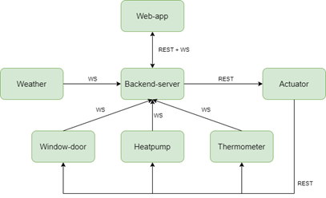

# ReactiveHomeAutomationSystem - Giulia Oddi & Luca Taverna
Il progetto ha avuto come obiettivo lo sviluppo di un sistema che effettui la simulazione di una singola stanza automatizzata caratterizzata dalla presenza di alcuni sensori. Le varie componenti del sistema sono realizzate come microservizi e vengono eseguite in container Docker. 

Le componenti sono:
* **Web-app**: fornisce una interfaccia utente per monitorare e modificare lo stato della stanza;
* **Backend**: permette il dialogo tra il frontend ed i vari sensori, propagando i comandi degli utenti all’attuatore e ricevendo gli stati aggiornati dai vari sensori, che verranno poi mostrati all’utente tramite web-app;
* **Attuatore**: riceve dal backend lo stato aggiornato del sistema ed i comandi inseriti dall’utente e ne controlla la validità;
* **Weather-service**: microservizio che periodicamente invia al backend una temperatura che simula quella esterna;
* **Window-door**: definisce il comportamento dei sensori porte e dei sensori finestre che possono essere aperte, chiuse o in stato di errore;
* **Heatpump**: definisce il comportamento dei sensori pompa di calore che può essere accesa, spenta o in stato di errore e la temperatura a cui deve operare;
* **Thermometer**: definisce il comportamento del sensore termometro, che simula il cambiamento dI temperatura nella stanza in base agli stati degli altri sensori;  

### Containers Docker
L’esecuzione dei microservizi avviene tramite l’utilizzo di Docker Compose. In particolare, nel file docker-compose.yml viene definita una rete di tipo *bridge*, poiché i microservizi definiti all’interno dei containers sono standalone e necessitano di comunicare tra loro. La rete utilizza la subnet *10.88.0.0/16*, avente quindi una subnet mask di 16 bit. In alcuni servizi, per facilitare le connessioni websocket, è stato specificato tramite *depends_on* quali container devono già essere in esecuzione (*condition: service_started*) prima di potersi avviare. 
Sono stati definiti i seguenti containers:

* **weather-service**: crea l’immagine a partire dalla directory *./weather-service*.
* **window-door**: crea l’immagine a partire dalla directory *./sensor-service/window-door*.
* **heatpump-service**: crea l’immagine a partire dalla directory *./sensor-service/heat-pump*.
* **thermometer-service**: crea l’immagine a partire dalla directory *./sensor-service/thermometer*.
* **actuator-service**: crea l’immagine a partire dalla directory *./actuator-service*.
* **backend-server**: crea l’immagine a partire dalla directory *./backend* e gli assegna l’indirizzo *10.88.0.11*. Dipende da: weather-service, window-door, heatpump-service, thermometer-service. 
* **web-app**: crea l’immagine a partire dalla directory *./frontend*. Dipende da: backend-server.

Inoltre in ogni servizio è stato inserito *restart: unless-stopped*, per permettere ai container di riavviarsi in caso di spegnimento.

Ogni container viene costruito tramite il suo specifico Dockerfile, nel quale sono contenute le istruzioni necessarie alla sua esecuzione. Ad esempio, nel Dockerfile del backend viene specificato di utilizzare *node:12-alpine* come immagine base e vengono specificate le directory necessarie da copiare nel file system del container per poi eseguire il file server.js tramite npm. 

Tutti i microservizi comunicano tra loro, tramite le interazioni riportate nel diagramma:
<div style="display: flex;">
    
</div>
<br>

## Per eseguire l'applicazione
Scaricare la cartella: 
```shell
    git clone https://github.com/giuliaOddi/ReactiveHomeAutomationSystem.git
```
```shell
    cd ReactiveHomeAutomationSystem
```
L’esecuzione dell’applicazione avviene tramite l’utilizzo di Docker Compose ed in particolare l’applicazione viene avviata tramite il comando: 
```shell
    docker-compose up --build 
```

Accedere tramite il link (utilizzando il browser Firefox):

http://oddi-taverna.soi2223.unipr.it:8080/

N.B: per effettuare l'accesso all'applicazione web è necessario autenticarsi tramite un account Google.

#### Per rimuovere i container:
```shell
    docker-compose down --remove-orphans
```

### Attenzione!
Per far in modo che l’url indicato venga risolto nell’indirizzo della macchina locale, è necessario aver modificato, tramite permessi di root, il file  /etc/hosts (sudo vim /etc/hosts) inserendo: 
```shell
    127.0.0.1       oddi-taverna.soi2223.unipr.it www.oddi-taverna.soi2223.unipr.it
```

