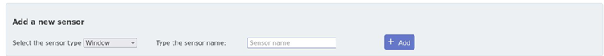
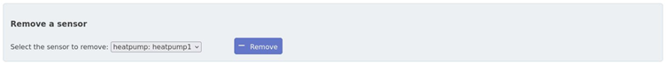
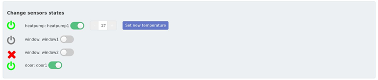
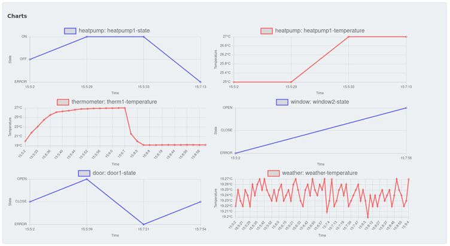

# Web app

Per permettere le richieste HTTP all’url http://oddi-taverna.soi2223.unipr.it:8080/ e la comunicazione tramite websocket con il backend, è stato modificato il file di configurazione di Apache (*my-httpd.conf*) inserendo:

```shell
<VirtualHost *:80>
    ServerName oddi-taverna.soi2223.unipr.it
    ServerAlias www.oddi-taverna.soi2223.unipr.it oddi-taverna.soi2223.unipr.it

    ProxyPass     /api/        http://10.88.0.11:8000/
    ProxyPass     /ws      ws://10.88.0.11:7000/
    ProxyPassReverse     /ws       ws://10.88.0.11:7000/
</VirtualHost>
```
Accedendo all’indirizzo http://oddi-taverna.soi2223.unipr.it:8080/, all’utente viene chiesto di effettuare l’autenticazione, che avviene utilizzando OpenID fornito da Google. Per fare ciò, sono state aggiornate le credenziali di Google OAuth e inserite nel file *.env*: 

```shell
OIDC_CLIENT_ID="851422523733-satu711g8moegjea5rt74n5rlpf59mbn.apps.googleusercontent.com"
OIDC_SECRET="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"
OIDC_REDIRECT="http://oddi-taverna.soi2223.unipr.it:8080"
```
Per il login è quindi necessario un account Google. Inserendo email e password, il frontend comunica tramite REST con il backend per validarle e permettere, tramite l’uso di un token, l’accesso all’applicazione.

Dopo che l’utente è stato autenticato, la web app comunica con il backend tramite le websocket, per ottenere gli aggiornamenti sugli stati dei sensori della stanza ed inoltre per inoltrare i comandi specificati dall’utente tramite interfaccia grafica. In particolare, il frontend si sottoscrive al websocket server del backend reperibile all’indirizzo 10.88.0.11:7000 tramite il messaggio 

``` shell 
{"type": "subscribe", "target": "room_properties"}
```
In questo modo tramite il paradigma publish-subscribe il frontend riceve costantemente aggiornamenti sullo stato della stanza. Il frontend utilizza poi la stessa websocket per inviare i comandi per richiedere un cambio di stato da parte dei sensori.

## Single Page Application
Lo stato della stanza viene mostrato all’utente tramite una Single Page Application caratterizzata da 4 differenti sezioni:

### Add a new sensor: 
<div style="display: flex;">
    
</div>
<br>

Sezione dedicata all’aggiunta di nuovi sensori. In questa sezione viene chiesto all’utente di scegliere, tramite un menu a tendina, il tipo del sensore da aggiungere tra door, window, thermometer oppure heatpump e il nome ad esso associato. Inoltre, se l’utente decide di aggiungere una pompa di calore, viene chiesto di specificare anche la temperatura desiderata, che deve essere compresa tra 15 e 35. \
Il sistema, oltre che a controllare la validità della temperatura inserita, controlla che non esista già un sensore dello stesso tipo con il nome specificato. 
Se i dati inseriti sono validi, tramite il button *“Add”* vengono inviati i seguenti dati al backend:

``` shell 
addSensor = {   action: ADD,
                sensor_type: type,
                sensor_name: name,
                state: OFF_CLOSE,
                temperature: temperature};
```
Come si può notare, lo stato viene impostato di default a chiuso oppure spento, in base al tipo di sensore.


### Remove a sensor: 
<div style="display: flex;">
    
</div>
<br>

Sezione dedicata alla rimozione di sensori già esistenti. L’utente può scegliere il sensore da rimuovere tramite un menu a tendina, che viene aggiornato dal frontend ogni volta che riceve la lista dei sensori aggiornata. Tramite il button *“Remove”*, quindi, viene inviato al backend il messaggio per la rimozione del sensore:

``` shell 
removeSensor = {    action: REMOVE,
                    sensor_type: type,
                    sensor_name: name };  
```

### Change sensors states: 
<div style="display: flex;">
    
</div>
<br>
Sezione dedicata ai cambiamenti di stato dei vari sensori. Di ogni sensore viene indicato, a sinistra del nome, lo stato corrente, tramite un’icona:

* *verde*: acceso o aperto;
* *grigio*: spento o chiuso;
* *rosso*: stato di errore.

Tramite un toggle switch, l’utente può inviare un comando di cambiamento di stato:

``` shell 
changeState = {	action: state,
        		sensor_type: type,
        		sensor_name: name };
```

Inoltre, se il sensore è in stato di errore, cliccando sul toggle switch è possibile riportare il sensore in uno stato operativo. \
Il toggle switch non permette di cambiare nuovamente lo stato di un sensore fino a che l’ultimo cambiamento non ha avuto l’effetto desiderato. Nel caso in cui lo si ripremesse prima di ciò, il frontend invierà nuovamente al backend l’ultimo comando di cambio stato inviato. Per esempio, se è stato premuto il toggle switch di una finestra per aprirla, esso non potrà inviare il comando per chiuderla fino a che l’icona associata non sarà diventata verde (sensore acceso), se viene comunque premuto il frontend invierà nuovamente il comando di aprire quella finestra. \
Per quanto riguarda le pompe di calore, in questa sezione è possibile anche modificare la temperatura operativa, tramite i pulsanti +/-, e inviarla tramite il button *“Set new temperature”*. Questo avviene solo se la pompa di calore è accesa. In caso contrario, viene mostrato un messaggio di errore. Il messaggio inviato al backend è il seguente:

``` shell 
changeTemperature = { 	action: ON_OPEN,
         	            sensor_type: 'heatpump',
         	            sensor_name: name,
         	            state: state, 
         	            temperature: temperature };  
```
La gestione dei cambiamenti degli stati avviene tramite un **BehaviorSubject** (RxJS), che usa la lista dei sensori aggiornata come valore iniziale e che emette come eventi i cambiamenti di essa ricevuti dal backend. Questi cambiamenti vengono estratti tramite il metodo *.pipe()* di RxJS, in cui vengono cercati i sensori modificati (aggiunti oppure a cui sono state modificate le proprietà) ed i sensori rimossi. \
Successivamente, tramite il metodo *.subscribe()*, vengono gestiti e/o creati gli elementi di html che permettono di visualizzare e di modificare le proprietà dei sensori. 

### Charts: 
<div style="display: flex;">
    
</div>
<br>

Read only dashboard contenente i grafici relativi agli stati (in blu) ed alle temperature (in rosso) dei sensori della stanza e del weather-service. \
Anche in questo caso, per la gestione degli eventi viene utilizzato il BehaviorSubject e quindi gli aggiornamenti della lista dei sensori sono gestiti tramite il metodo *.subscribe()*. In particolare, tramite la libreria Chart.js, ogni volta che viene aggiunto un sensore vengono creati i relativi grafici, tramite il metodo *.create_chart()*, e successivamente questi vengono aggiornati ogni volta che viene ricevuto un cambiamento dello stato e/o della temperatura tramite il metodo *.push()*, per inserire il nuovo valore arrivato, ed il metodo *.update()*, per mostrare il grafico aggiornato. Inoltre, se viene riscontrata la rimozione di un sensore, i grafici relativi ad esso vengono rimossi.
